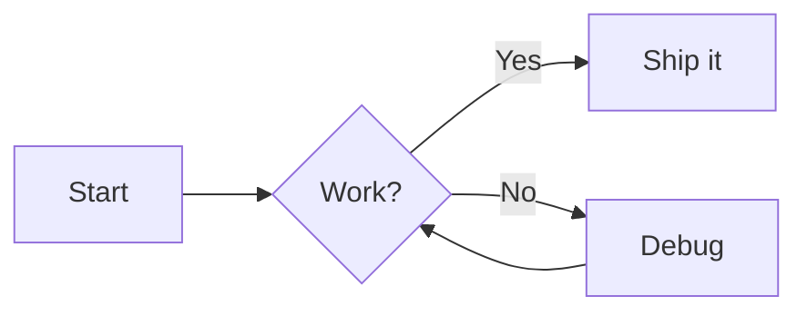
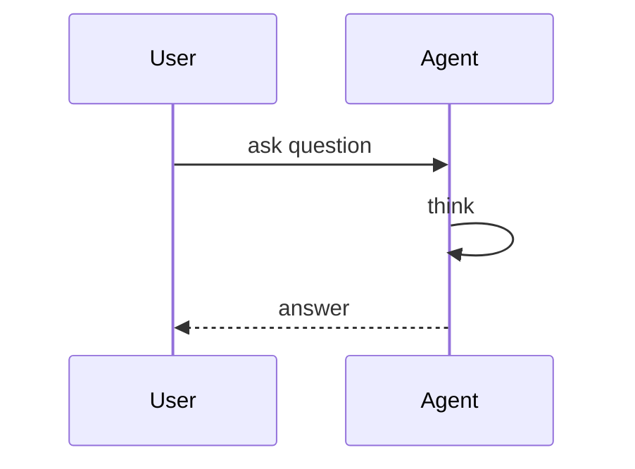
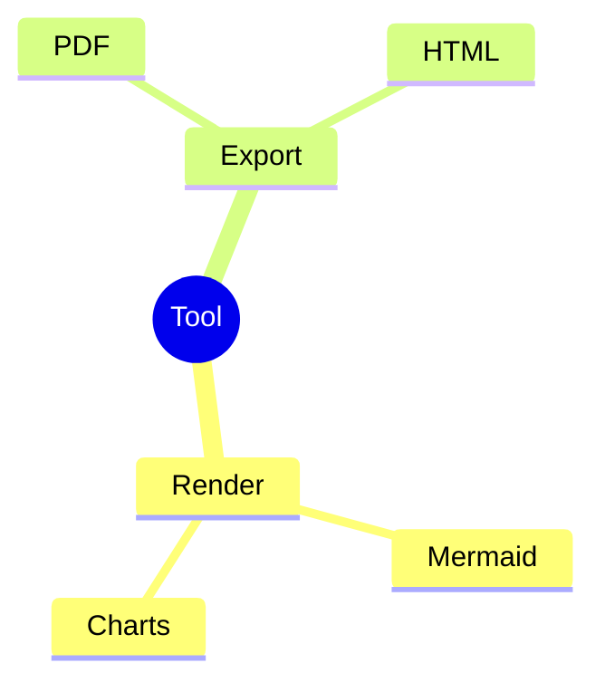

# Sample Document

This is a sample Markdown file used to smoke-test the tool (`npm test`).

## A flowchart



## A sequence diagram



## A mindmap



## Code sample

```python
def hello():
    print("world")
```